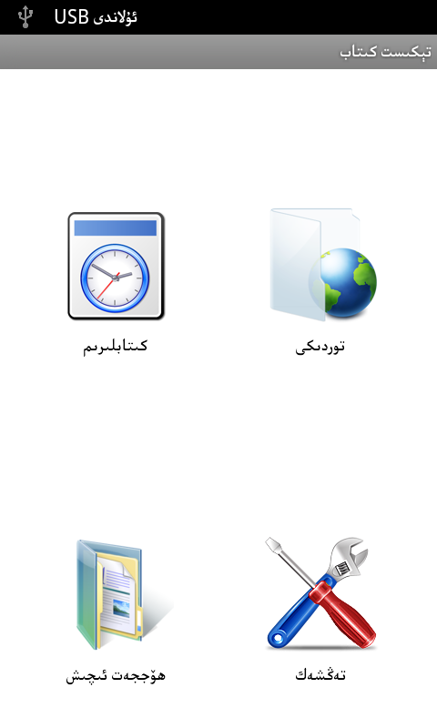
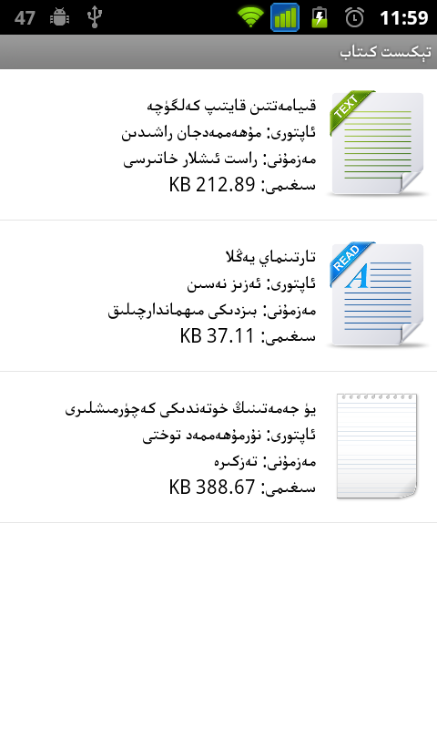
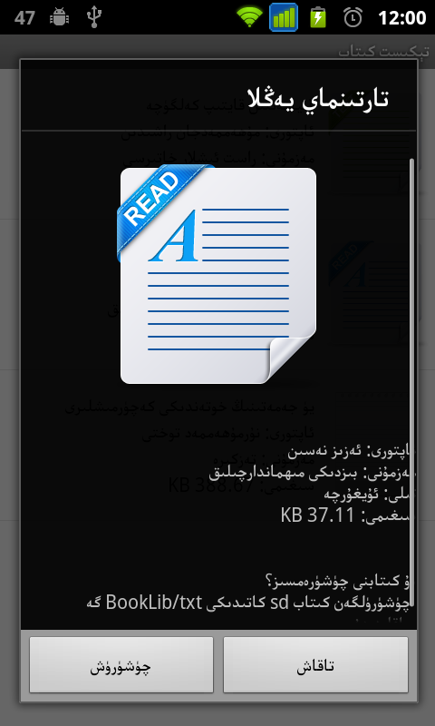
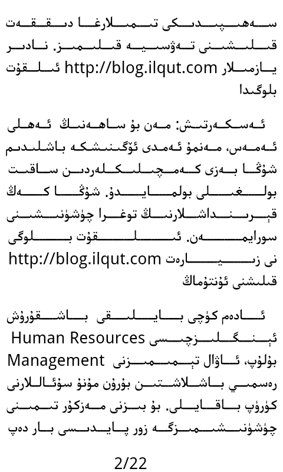

Text Reader for Android devices that does not support Uyghur language.

ئىقتىدارى: ئۈسكۈنىنىڭ چەرقانداق ئورنىدىكى تېكىست ھۆججىتىنى تېپىپ ئاچقىلى بولىدۇ. ھۆججەت تېكىستىنى ئىكران چوڭلۇقىغا ئاساسەن بەتكە بۆلۈپ چىقىرىپ بېرىدۇ. مۇۋاپىق ئورۇندىن قۇرغا ئايرىيدۇ ۋە تەڭ ئۇزۇنلۇقتا تەكشىلەيدۇ. ئىكراننى بىسىپ بەتنى ئوڭ-سولغا يۆتكىگىلى ۋە بەت ئالماشتۇرغىلى بولىدۇ. خەت نۇسخىسى، خەت رەڭگى، تەگلىك رەڭگى، خەت چوڭلۇقى، بەت چۆرىسى ۋە ئابزاس بۆلگۈچنى تەڭشىگىلى بولىدۇ. بەلگىلەنگەن تەڭشەك پىروگراممىنى تاقىغاندىمۇ ساقلىنىپ قالىدۇ.

Screenshots:
---------

Download Link:
---------

* [Donwload from Google Play](https://play.google.com/store/apps/details?id=net.uyghurdev.uyghurtextreader)

* [Download from Bilkan Bazar](http://bazar.bilkan.net/App.aspx?id=214)

Used Open Source Projects:
---------
* [Arabic Reshaper](https://github.com/AZIZHUSS/Arabic-Reshaper)
* [Better-Arabic-Reshaper](https://github.com/agawish/Better-Arabic-Reshaper)
